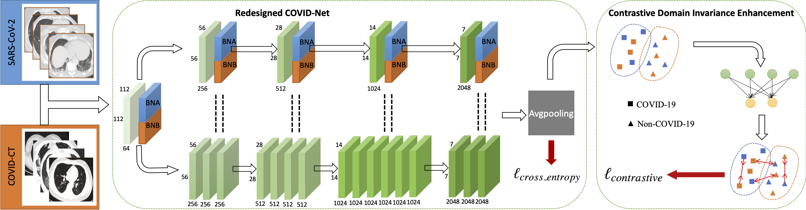

# Multi-site COVID-Net CT Classification
This is the pytorch implemention of our paper [***Contrastive Cross-site Learning with Redesigned Model for COVID CT Classification***]() by [Zhao Wang](http://kyfafyd.wang/), [Quande Liu](https://liuquande.github.io/), [Qi Dou](http://www.cse.cuhk.edu.hk/~qdou/)

## Abatract

> The pandemic of coronavirus disease 2019 (COVID-19) has lead to a global public health crisis spreading hundreds of countries in its five months. With the continuous growth of new infections, developing automated tools for COVID-19 identification with CT imaging is urgently desired to assist the clinical diagnosis and reduce the tedious workload of image interpretation.  With current situation of the insufficiency of available COVID-19 images, it is essential to aggregate the cases from different medical systems for robust model development.  This paper proposes a novel joint learning framework to perform highly-accurate COVID-19 identification by effectively learning with heterogeneous datasets from different public data sources. We build a powerful backbone by redesigning the recently proposed COVID-Net in aspects of network architecture and learning strategy to improve the diagnosis accuracy and learning efficiency. On top of our revised backbone, we further explicitly tackle the cross-site data heterogeneity by conducting separate feature normalization in latent space. Moreover, we propose a contrastive training objective to enhance the domain invariance of semantic embeddings for boosting the classification performance on each dataset. We develop and evaluate our method with two public large-scale COVID-19 diagnosis datasets from real CT images. Extensive experiments show that our approach consistently improves the performances on both datasets, as well as outperforms several state-of-the-art joint learning methods.



## Usage

#### Setup

```shell
git clone https://github.com/med-air/Contrastive-COVIDNet
cd Contrastive-COVIDNet
pip install -r requirements.txt 
```

#### Dataset

Download from [Google Drive](https://drive.google.com/file/d/1JBp9RH9-yBEdtkNYDi6wWL79o62JD5Td/view?usp=sharing) and put into data/ directory.

#### Pretrained Model

You can directly download our pretrained model from [Google Drive](https://drive.google.com/file/d/1ZwtxF4c_pvyv_uyE4Zx4_bNNHQx7Y_Ao/view?usp=sharing) and put into saved/ directory for testing.

#### Training

```shell
cd code
python main.py --bna True --bnd True --cosine True --cont True
```

#### Test

```shell
cd code
python test.py
```

## Citation
If you find this code useful, please cite in your research papers.
```
@misc{wang2020contrastive,
    title={Contrastive Cross-site Learning with Redesigned Model for COVID CT Classification},
    author={Wang, Zhao and Liu, Quande and Dou, Qi},
    journal={https://github.com/med-air/Contrastive-COVIDNet},
    year={2020}
}
```


## Questions

For further questions, pls feel free to contact [Zhao Wang](mailto:kyfafyd@zju.edu.cn)
